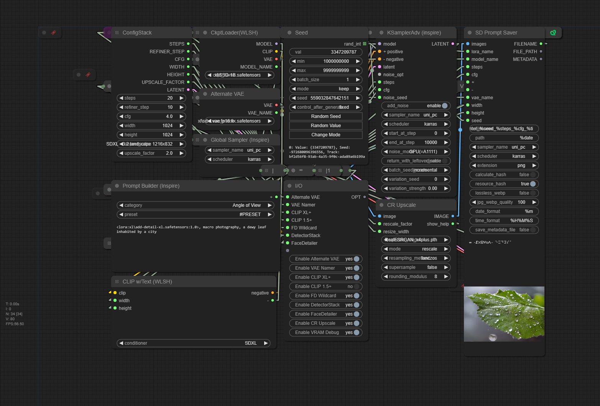

# comfyui-workflows

> Low VRAM Stable Diffusion Workflows for [ComfyUI](https://github.com/comfyanonymous/comfyui)
>
> Support my work [here!](https://ko-fi.com/exdysa)

# [Ars Mentalia - ComfyUI Workflow - XL 1.5 Cascade / i2i / t2i](ars%20mentalia/ars_mentalia.json)

> 高達30%的XL推斷速度加速度。 自動備份和容錯。 強大的流量控制。 A1111可重現性。 SDXL、SD1.5和穩定級聯之間的交換。 從2GB的VRAM到尖端的發電器。 包括說明。 感謝您的下載。
Txt2Img & Img2Img.

> - [x] Support Stable Diffusion SD, XL, v1.5, (Stable Cascade on versions below 0.0.59)
> - [x] Universal language labelling, meant to be intuitive and thouroughly documented
> - [x] Reliable on 2GB VRAM /// scaling performance on cutting edge hardware
> - [x] Fits comfortably within 1080 resolution
> - [x] View Switching - `~123` Keys navigate to important settings, full screen preview
> - [x] Precision variation seed control and history
> - [x] Up to 30% XL inference speed acceleration.
> - [x] Automatic backup and fault tolerance.
> - [x] Powerful flow control. A1111 reproducibility. 
> - [x] Exchange between SDXL, SD1.5, and Stable Cascade. 
> - [x] Clip Skip
> - [x] Alternate Refiner process
> - [x] Hybrid SD/Xl/1.5 workflow
> - [x] Readily adaptable to other models - (Pixart A/E, Diffusers)
> - [ ] Tiling upscale
> - [ ] ControlNet pre-setup
> - [ ] Automatic Hand/Face inpainting and Upscale
> - [ ] Onediff optimizations (unsupported on my hardware)
> - [ ] T2 adaptors

> [!Note]
> More Information  [CIVITAI](https://civitai.com/models/501551)

> Removed 0.0.59:
>  - [x] Stable Cascade support

 
# [∞ / infinity ](infinity/workflow ∞(1).json)
> - [x] Support Stable Diffusion XL Distilled and 1.5
> - [x] Three-dimensional z-index layout
> - [x] Automatic Hand/Face inpainting and Upscale
> - [x] Fit comfortably within 1080 resolution
> - [x] View Switching - `~123` Keys navigate to important settings, full screen preview
> - [x] Precision variation seed control and history
> - [x] Mid-process VRAM management
> - [x] Organized, easy to rewire
> - [x] Reliable on 4GB VRAM
> - [ ] Clip Skip (next version)
> - [ ] Misc optimizations (onediff, hidiffusion, deepcache)
> - [ ] Lcm lora instructions
> - [ ] Alternate low mem XL refiner process
> - [ ] Hybrid Xl/1.5 workflow
> - [ ] Improved Zindex handling
> - [ ] SD3 Ready
> - [ ] Stable Cascade support
> - [ ] Other model support w/o bloat (Pixart A/E, Diffusers)

> [!NOTE]
> More information : [CIVITAI](https://civitai.com/models/434977)

